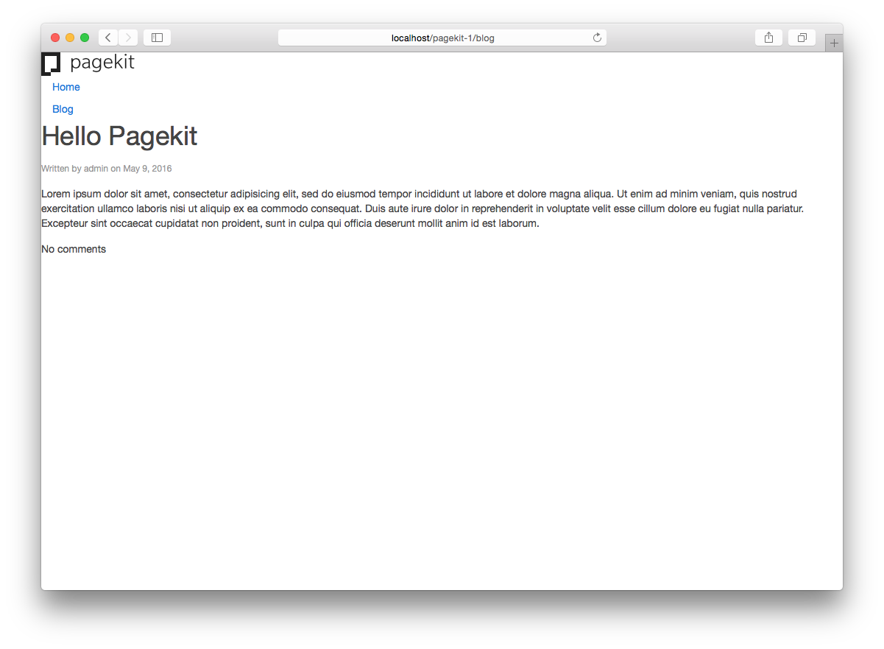
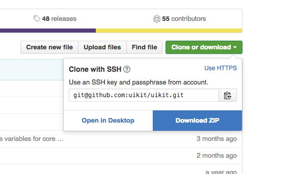
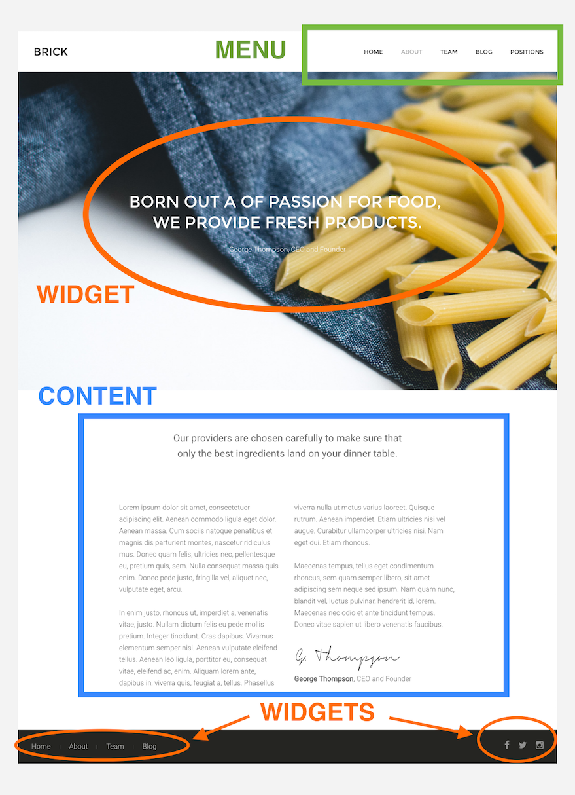
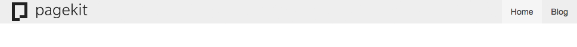
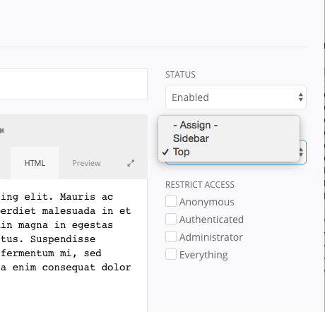

# How to develop a theme
In this guide you will learn how to develop your own theme from our Hello Theme blueprint. You will find out about the theme structure and follow the essential steps to add new positions and options.

## Getting started

For this guide, we assume you have a running Pagekit installation on a local server environment. If that is not the case, [download](https://pagekit.com/download) a Pagekit installation package and quickly [install](../getting-started/installation.md) it. Then login to the admin area and have a look at the Theme section of the integrated Marketplace.

The Pagekit Marketplace features our [Hello Theme](https://pagekit.com/marketplace/package/pagekit/theme-hello), a blueprint for developing themes, including code examples and a general foundation to help you get started.


_The Hello theme doesn't provide any styling, but gives you a good starting point to develop your own theme._

First of all install the theme from the Pagekit marketplace and have a look at the overall file structure. When installed, the *Hello* theme is located in *packages/pagekit/theme-hello*. If you develop your own themes in the future, we recommend to install a simple theme on the side for reference, like the default [Theme One](https://pagekit.com/marketplace/package/pagekit/theme-one). That way you can compare structural elements and get some inspiration. For this guide though, we only need Hello theme.

## Structure
Let's take a look at some of the central files and folders that you will deal with when developing your own theme.

```
/css
  theme.css               // skeleton css with pre-defined classes
/js
  theme.js                // empty file for your scripts
/views
  template.php            // renders the theme's output; logo, menu, main content, sidebar and footer positions are available by default
composer.json             // package definition so that Pagekit recognizes the theme
image.jpg                 // preview screenshot
index.php                 // the central theme configuration
CHANGELOG.md              // changes of current and previous versions
README.md                 // contains basic information
```

### Rename your theme

If you simpley change the files of Hello theme, any Marketplace updates to the theme will overwrite your changes. Also, you will probably want to give the theme your own custom name. If you decide to upload the theme to the marketplace, your even need to name it differently. This requires three simple steps:

1. Copy all files from `packages/pagekit/theme-hello` to `packages/your-name/your-theme` (you will need to create these folders).
2. Open `composer.json` and replace `"name": "pagekit/theme-hello",` with `"name": "your-name/your-theme"`. ALso change `"title": "Hello"` to `"title": "Your theme"`.
3. Open `index.php` and replace `'name' => 'theme-hello'` with `'name' => 'your-theme'`.

Out of simplicity, the rest of the guide will still call it `theme-hello` in the examples.

### CSS
Hello theme doesn't contain any styles. The included `css/theme.css` file lists all CSS classes that are rendered by the Pagekit core extensions without additional styling. You can add your own CSS to these classes.

The Pagekit admin interface and the Pagekit default themes are built with the [UIkit front-end framework](http://getuikit.com/). So you might want to consider using it for your project as well. In the following example we will be building our theme using UIkit. If you use another framework or no framework at all, the basic approach of including CSS is similar.

There are many possible ways to set up your theme's file structure. We can recommend two approaches here. One is the "classic" way of including plain CSS. The second one is more complex to set up initially, but allows for far more flexibility.

#### The simple way: Include plain CSS files

Go to the [UIkit website](http://getuikit.com/), download the latest release and unpack it. UIkit comes with three themes: Default, Gradient and Almost Flat. To include the Default theme, copy the `css/uikit.min.css` file from the UIkit package and paste it into the `theme-hello/css/` folder of your theme.

To make sure the file is loaded by Pagekit, open the main layout file of the theme which is located at `theme-hello/views/template.php`. 

In the `<head>` section of this layout file, we see that one CSS file is included already.

```
<?php $view->style('theme', 'theme:css/theme.css') ?>
```

Now add another line to add the UIkit CSS. Make sure to add it **above** the line that is already present, so that it looks as follows.

```
<?php $view->style('custom-uikit', 'theme:css/uikit.min.css') ?>
<?php $view->style('theme', 'theme:css/theme.css') ?>
```

That's it, your theme now contains UIkit's CSS. To add your own CSS rules, simply edit `theme-hello/css/theme.css`.



_Adding the CSS from UIkit will add default styling to the rendered markup. To actually make it pretty, we also need to add some classes to the markup, customize the default UIkit style and maybe add our own CSS styling_

#### The advanced way: Setup with Gulp and LESS

In the previous section we have seen how easy it is to add plain CSS files to your theme. If you have experience with building websites, you are probably familiar with more flexible ways of styling your content. A good example for this is using a CSS pre-processor like [LESS](http://lesscss.org/). This allows you to use things such as variables, which make your code easier to read and manage.

When using UIkit, this has the great advantage that you can simply modify a variable to apply global changes, for example altering the primary theme color.

To comfortably work with the LESS pre-processor, you should have a few tools installed and available on your command line: *npm*, *gulp* and *bower*. If you do not have them installed, do a quick Google search, there are plenty of tutorials available online.

There are a number of possible file structure setups. In the following passage we suggest the structure that is also used for the official Pagekit themes. While it might look like many steps when you create a theme for the first time, in our experience this setup allows for well structured code, easy UIkit customizations and a comfortable way to keep UIkit up to date using Bower.

1. In your theme, create the new files `package.json`, `bower.json`, `.bowerrc`, `gulpfile.js` and `less/theme.less`. Paste the following contents into these files. If you have named your theme differently, replace any occurences of the string `theme-hello` with your theme name.

	`package.json`. This file defines all JavaScript dependencies that are installed when running `npm install` and includes several npm packages that we will we use, for example when compiling LESS to CSS:
	
	```
	{
	    "name": "theme-hello",
		"devDependencies": {
		     "bower": "*",
		     "gulp": "*",
		     "gulp-less": "*",
		     "gulp-rename": "*"
		 }
	}
	```
	
	`bower.json` tells bower to fetch the newest release of UIkit. That way you can always run `bower install` to fetch the current LESS source files from UIkit:
	
	```js
	{
		"name": "theme-hello",
		"dependencies": {
			"uikit": "*"
		},
		"private": true
	}
	```
	
    `.bowerrc` includes configuration settings for bower. By default, bower installs everything in a directory called `/bower_components` inside the theme directory. Simply out of preference, we change that default directory:
	
	```js
	{
	    "directory": "app/assets"
	}
	```
	
	`gulpfile.js` contains all tasks which we can run using Gulp. We only need a task to compile LESS to CSS. For convenience we also add a `watch` task that can be run to automatically recompile LESS when any changes to the files have been detected:
	
	```js
	var gulp       = require('gulp'),
	    less       = require('gulp-less'),
	    rename     = require('gulp-rename');
	
		gulp.task('default', function () {
		    return gulp.src('less/theme.less', {base: __dirname})
		        .pipe(less({compress: true}))
		        .pipe(rename(function (file) {
		            // the compiled file should be stored in the css/ folder instead of the less/ folder
		            file.dirname = file.dirname.replace('less', 'css');
		        }))
		        .pipe(gulp.dest(__dirname));
        });
		
		gulp.task('watch', function () {
		    gulp.watch('less/*.less', ['default']);
		});

    ```
	
	`less/theme.less` is the place where you store your theme's styles. Mind that you first need to import UIkit so that it is also compiled by the Gulp task we have defined above.
	
	```less
	@import "uikit/uikit.less";
	
	// use icon font from system
	@icon-font-path: "../../../../app/assets/uikit/fonts";
	
	// your theme styles will follow here...
	```
	
	`.gitignore` is an optional file that is useful when you manage your code using Git. In Hello theme, a version of the file already exists. You can add new entries so that it looks as follows. You probably don't want to commit the downloaded packages by bower and the generated CSS. Just make sure to include the generated CSS when you upload the theme to your server or the Pagekit Marketplace.
	
	```
	/app/bundle/*
	/app/assets/*
	/node_modules
	/css
	.DS_Store
	.idea
	*.zip
	```
	
2. After you have created the files above, go to the [UIkit Github repository](https://github.com/uikit/uikit), download the Zip, unpack it and find the `themes/default` folder (or one of the other themes, if you like). Note that you need the Github version for this, not the css-only version we have downloaded in the simple setup.
	
	

3. Create a `/less` folder inside your theme, copy and paste the `default` theme folder in there and rename it to `/uikit`, so that it is located at `less/uikit` inside your theme folder.
4. The style we just copied needs to import the core UIkit LESS, so that it can be compiled successfully. To make this possible, you need to update the import path in your theme's `less/uikit/uikit.less` file. Make sure to change the import in line 4 to the following path: `@import "../../app/assets/uikit/less/uikit.less";`
5. Open your theme in a new console tab (for example `cd pagekit/packages/theme-hello`) and run `npm install`, `bower install` and `gulp`.

Now, that were quite a few steps. Make sure your file structure looks as follows now (plus additional theme files that were there before):

```
app/
    assets/
        jquery/    result of bower install
        uikit/     result of bower install
css/
    theme.css      result of gulp
less/
    uikit/
        ... uikit components
    	uikit.less
    theme.less
node_modules/      result of npm install
.bowerrc
bower.json
gulpfile.js
package.json
... other theme files 
```

With this file setup in place, we have now achieved the following:

- **Separation** of theme styles and UIkit customizations. Add your own styles in `less/theme.less`, customize UIkit in `less/uikit/*`
- **Easily customize UIkit**: Every UIkit component's settings are located in its own `*.less` file. For example, to change the body font size, open `less/uikit/base.less` and change the value of `@base-body-font-size`, then re-run `gulp`. To use any of the [UIkit add-on components](http://getuikit.com/docs/components.html), open `less/uikit.less` and import the add-on's less file from the `app/assets` directory, for example for the slideshow, add the line: `@import "../../app/assets/uikit/less/components/slideshow.less";` and re-run `gulp.`
- **Easily update UIkit**: Run `bower install` to fetch the newest version of UIkit and run `gulp` to re-compile your LESS files to CSS.
 

## Adding JavaScript

Included in Hello theme, you will find an empty JavaScript file `js/script.js`. Here, you can add your own JavaScript code. In Hello Theme, the file is loaded because it is already included in the `template.php` as follows:

```
<?php $view->script('theme', 'theme:js/theme.js') ?>
```

When including a script, it needs a unique identifier (`theme`) and the path to the script file (`theme:js/theme.js`). As you can see, you can use `theme:` as a short version for the file path to your theme directory. To add more JavaScript files, simply add more lines in the same way. Make sure to assign different identifier to the scripts. If you would call all of them `theme`, only the last one will be included.

```
<?php $view->script('theme', 'theme:js/theme.js') ?>
<?php $view->script('plugins', 'theme:js/plugins.js') ?>
<?php $view->script('slideshow', 'theme:js/slideshow.js') ?>
```

While adding multiple `script()` calls is the simplest way to include JavaScript, the `script()` helper allows for way more powerful ways to include JavaScript files which can also depend on each other. Let us look at that in more depth in the next sections.

### Adding multiple JavaScript files with dependencies

In the earlier examples we have now worked with CSS from UIkit. If you also want to use UIkit's JavaScript components and utilities, it makes sense to add the UIkit JavaScript files. Note that UIkit requires loading jQuery before you can use the UIkit JavaScript components. 

Locate the previous line `script('theme', ...)` in the head of `views/template.php` and replace it with the following three lines.

```
<?php $view->script('theme-jquery', 'theme:app/assets/jquery/dist/jquery.min.js') ?>
<?php $view->script('theme-uikit', 'theme:app/assets/uikit/js/uikit.min.js', 'theme-jquery') ?>
<?php $view->script('theme', 'theme:js/theme.js', 'theme-uikit') ?>
```

This example assumes you have used the advanced setup from above, where bower has installed both UIkit and jQuery into the `app/assets` folder. If you are working with a simpler setup instead, just download and copy `jquery.min.js` and `uikit.min.js` to some place in your theme and change the paths in the example accordingly.

Note how we now add a third parameter, which defines _dependencies_ of the script that we are loading. Dependencies are other JavaScript files that have to be loaded earlier. So in the example, Pagekit will definitely make sure to load the three files in the following order: jQuery, UIkit and then our own `theme.js`. In this specific example, this mechanism does not seem very useful, because the scripts will probably be loaded in exactly the order that we put them in the `template.php`, right? That is correct, but imagine these lines being located in different files and sub-templates of your theme. Defining dependencies will make sure that Pagekit always loads the files in a correct order.

As you can already see in the example above, dependencies are referenced using the unique string identifier (e.g. `theme-jquery`). In our example, this identifier is given to the script the first time it is included using the `script()` method. So, as you have seen now, this method takes three parameters: `$view->script($identifier, $path_to_script, $dependencies)`.

To confirm this has worked, open `views/template.php` and add the following lines (`data-uk-*` is the prefix for UIkit's JavaScript components).

```
<!-- ADD id="up" to body -->
<body id="up"> 

	<!-- LEAVE existing content ... -->
	...
	
	<!-- ADD to-top-scroller -->
	<div class="uk-text-center">
       <a href="#up" data-uk-smooth-scroll=""><i class="uk-icon-caret-up"></i></a>
    </div>

	<!-- LEAVE rendering of footer section  -->
    <?= $view->render('footer') ?>

</body>
```

When you refresh the browser, you will see a small arrow that you can use to smoothly scroll to the top of the browser window. If the browser does not scroll smoothly, but jumps immediately, please check if you have written everything exactly as in the examples.

### Adding third party scripts, like jQuery

You may ask yourself why we called the included jQuery script `theme-jquery` and not simply `jquery`. In general, it is always useful to prefix your own identifiers, to avoid collisions with other extensions. However, in this specific example, the identifiers `jquery` and `uikit` are already taken, because Pagekit itself includes jQuery and UIkit. This means that you can already load these JavaScript files without including them in your theme. That way, all themes and extensions can share a single version of jQuery (and UIkit, if they use UIkit) to avoid conflicts.

```
<?php $view->script('theme', 'theme:js/theme.js', ['uikit', 'jquery']) ?>
```

As you can see in the example, the third parameter of the `script()` method can also take a list of multiple dependencies. In the earlier example we have only passed in a single string (for example `theme-jquery`). Pass in a string for a single dependency, or a list for multiple depencies — both are possible.

The currently loaded version of jQuery and UIkit depend on the current version of Pagekit. With new releases of Pagekit, the versions of these libraries will continually be updated. While this allows for always having a current version available, a potential downside would be that you need to make sure your code also works for the new versions of these libraries.

## Layout
The central files for your theme's layout are `views/template.php` and `index.php`. The actual rendering happens in the `template.php`. 

When you open the `template.php`, you see a very basic setup for you to get started. Let's wrapping a container around our main content and divide the system output and sidebar into a grid.

Around **line 30** the `views/template.php` file renders the sidebar position and the actual content.

```
<!-- Render widget position -->
<?php if ($view->position()->exists('sidebar')) : ?>
    <?= $view->position('sidebar') ?>
<?php endif; ?>

<!-- Render content -->
<?= $view->render('content') ?>
```

Using UIkit's [Block](http://getuikit.com/docs/block.html) and [Utility](http://getuikit.com/docs/utility.html) components, we will create a position block and a container with a fluid width.

It is always a good idea to prefix your own classes, so they will not collide with other CSS you might be using. For example, all UIkit classes are prefixed `uk-`. To distinguish classes or IDs that come from this theme, we will use the prefix `tm-`. Consequently, we add the class and ID `tm-main` to identify the section.

```
<div id="tm-main" class="tm-main uk-block">
    <div class="uk-container uk-container-center">

        <!-- Render widget position -->
        <?php if ($view->position()->exists('sidebar')) : ?>
            <?= $view->position('sidebar') ?>
        <?php endif; ?>

        <!-- Render content -->
        <?= $view->render('content') ?>

    </div>
</div>
```

Now we want the system output and sidebar to actually be side by side. The [Grid](http://getuikit.com/docs/grid.html) component can help us here. For a more semantic layout, we will use `<main>` and `<aside>` elements for the containers.

```
<div id="tm-main" class="tm-main uk-block">
    <div class="uk-container uk-container-center">

        <div class="uk-grid" data-uk-grid-match data-uk-grid-margin>

            <main class="<?= $view->position()->exists('sidebar') ? 'uk-width-medium-3-4' : 'uk-width-1-1'; ?>">

                <!-- Render content -->
                <?= $view->render('content') ?>

            </main>

            <?php if ($view->position()->exists('sidebar')) : ?>
            <aside class="uk-width-medium-1-4">
                <?= $view->position('sidebar') ?>
            </aside>
            <?php endif; ?>

        </div>

    </div>
</div>
```

### Theme elements

To create more complex layouts, you can add your own widget positions, menus and options for both. A regular theme basically consists of widgets, menus and the page content itself.

The page *content* is nothing other than Pagekit's system output. That means that the content of any page you create will be rendered in this area.

*Widgets* are small chunks of content that you can render in different positions of your site, so that they will be displayed in specific locations of your site's markup.

To navigate through any site, you first need to set up a *menu*. For this purpose, Pagekit provides different menu positions that allow users to publish menus in several locations of the theme markup.



_A typical site layout consists of the main navigation, the page content and several widget positions_

However, your theme needs to register all positions before. This happens in the `index.php` file through the `menus` and `positions` properties. These contain arrays of the position name and a label, which is displayed in the admin panel. This file is also used to load additional scripts and much more.

## Navbar

One of the first things you will want to render in your theme is the main navigation. 


_By default, the Hello theme renders menu items in a very simple vertical navigation._

1. Hello theme comes with the predefined *Main* menu position. When adding a new position it needs to be defined by an identifier (i.e. `main`) and a label to be displayed to the user (i.e. *Main*).

    ```
    'menu' => [
    
        'main' => 'Main',
    
    ]
    ```
    
    
	
    _A menu can be published to the defined positions in the Pagekit Site Tree_

2. With the concept of modularity in mind, Pagekit renders position layouts in separate files. For the navigation, create the `views/menu-navbar.php` file containing the following:

	```
    <?php if ($root->getDepth() === 0) : ?>
    <ul class="uk-navbar-nav">
    <?php endif ?>
	
        <?php foreach ($root->getChildren() as $node) : ?>
        <li class="<?= $node->hasChildren() ? 'uk-parent' : '' ?><?= $node->get('active') ? ' uk-active' : '' ?>" <?= ($root->getDepth() === 0 && $node->hasChildren()) ? 'data-uk-dropdown':'' ?>>
            <a href="<?= $node->getUrl() ?>"><?= $node->title ?></a>
	
            <?php if ($node->hasChildren()) : ?>
	
                <?php if ($root->getDepth() === 0) : ?>
                <div class="uk-dropdown uk-dropdown-navbar">
                <?php endif ?>
	
                    <?php if ($root->getDepth() === 0) : ?>
                    <ul class="uk-nav uk-nav-navbar">
                    <?php elseif ($root->getDepth() === 1) : ?>
                    <ul class="uk-nav-sub">
                    <?php else : ?>
                    <ul>
                    <?php endif ?>
                        <?= $view->render('menu-navbar.php', ['root' => $node]) ?>
                    </ul>
	
                <?php if ($root->getDepth() === 0) : ?>
                </div>
                <?php endif ?>
	
            <?php endif ?>
	
        </li>
        <?php endforeach ?>
	
    <?php if ($root->getDepth() === 0) : ?>
    </ul>
    <?php endif ?>
	```

3. To render the actual navbar in the `template.php` file, create a `<nav>` element and add the `.uk-navbar` class. Load the `menu-navbar.php` file inside the element as follows (you can remove the existing block where `$view->menu('main')` is rendered).

	```
    <nav class="uk-navbar">
	
        <?php if ($view->menu()->exists('main')) : ?>
        <div class="uk-navbar-flip">
            <?= $view->menu('main', 'menu-navbar.php') ?>
        </div>
        <?php endif ?>
	
    </nav>
	```

    The main menu should now automatically be rendered in the new *Navbar* position. 

4. You will probably also want the logo to appear inside the navbar. So wrap the `<nav>` element around the logo as well and add the `.uk-navbar-brand` class, to apply the appropriate spacing.

    ```
    <nav class="uk-navbar">

        <!-- Render logo or title with site URL -->
        <a class="uk-navbar-brand" href="<?= $view->url()->get() ?>">
            <?php if ($logo = $params['logo']) : ?>
                escape($logo) ?>" alt="">
            <?php else : ?>
                <?= $params['title'] ?>
            <?php endif ?>
        </a>

        <?php if ($view->menu()->exists('main')) : ?>
        <div class="uk-navbar-flip">
            <?= $view->menu('main', 'menu-navbar.php') ?>
        </div>
        <?php endif ?>

    </nav>
    ```

    

    _With our changes, menu items are now rendered in a horizontal navbar._

### Adding theme options

Pagekit uses [Vue.js](https://vuejs.org/) to build its administration interface. Here is a [Video tutorial](https://youtu.be/3gPGyhTroSA?list=PL2rU5GxE-MQ7aYIcxTmDh4-BTHRM-9lto) on Vue.js in Pagekit.

A frequently requested feature is for the navbar to remain fixed at the top of the browser window when scrolling down the site. In the following steps, we are going to add this as an option to our theme.

1. First, we need to create the folder `app/components` and in it the file `site-theme.vue`. Settings stored in this file affect the entire website and can be found under *Theme* in the *Settings* tab of the Site Tree. They cannot be applied to a specific page.

    

    _You can add any kind of Settings screen to the admin area_

    In the freshly created file `site-theme.vue` we add the option which will be displayed in the Pagekit administration.

    ```
    <template>

        <div class="uk-margin uk-flex uk-flex-space-between uk-flex-wrap" data-uk-margin>
            <div data-uk-margin>
                <h2 class="uk-margin-remove">{{ 'Theme' | trans }}</h2>
            </div>
            <div data-uk-margin>
                <button class="uk-button uk-button-primary" type="submit">{{ 'Save' | trans }}</button>
            </div>
        </div>

        <div class="uk-form uk-form-horizontal">

            <div class="uk-form-row">
                <label for="form-navbar-mode" class="uk-form-label">{{ 'Navbar Mode' | trans }}</label>
                <p class="uk-form-controls-condensed">
                    <label><input type="checkbox" v-model="config.navbar_sticky"> {{ 'Sticky Navigation' | trans }}</label>
                </p>
            </div>

        </div>

    </template>
    ```

2. Now we still have to make this option available in the Site Tree. To do so, we can create a *Theme* tab in the interface by adding the following script below the option in the `site-theme.vue` file.

    ```
    <script>

        module.exports = {

            section: {
                label: 'Theme',
                icon: 'pk-icon-large-brush',
                priority: 15
            },

            data: function () {
                return _.extend({config: {}}, window.$theme);
            },

            events: {

                save: function() {

                    this.$http.post('admin/system/settings/config', {name: this.name, config: this.config}).catch(function (res) {
                        this.$notify(res.data, 'danger');
                    });

                }

            }

        };

        window.Site.components['site-theme'] = module.exports;

    </script>
    ```

3. To load the script and add the option to the Site Tree, you also need to add the following to the `index.php` file.

    ```
    'events' => [

        'view.system/site/admin/settings' => function ($event, $view) use ($app) {
            $view->script('site-theme', 'theme:app/bundle/site-theme.js', 'site-settings');
            $view->data('$theme', $this);
        }

    ]
    ```

4. Add the default setting for the navbar mode in the `index.php` file.

    ```
    'config' => [
            'navbar_sticky' => false
        ],
    ```

5. Vue components need to be compiled into JavaScript using Webpack. To do so, create the file `webpack.config.js` in your theme folder:

    ```
    module.exports = [

        {
            entry: {
                "site-theme": "./app/components/site-theme.vue"
            },
            output: {
                filename: "./app/bundle/[name].js"
            },
            module: {
                loaders: [
                    { test: /\.vue$/, loader: "vue" }
                ]
            }
        }

    ];
    ```

6. After that, run the command `webpack` inside the theme folder and `site-theme.vue` will be compiled into `/bundle/site-theme.js` with the template markup converted to an inline string. 
	
	If you haven't worked with it before, you will quickly need to [install webpack globally](http://webpack.github.io/docs/installation.html) and then also run the following in your project directory to have a local webpack version and a Vue compiler available.

	```
	npm install webpack vue-loader vue-html-loader babel-core babel-loader babel-preset-es2015 babel-plugin-transform-runtime --save-dev
	```
	
    Whenever you now apply changes to the Vue component, you need to run this task again. Alternatively, you can run `webpack --watch` or `webpack -w` which will stay active and automatically recompile whenever you change the Vue component. You can quit this command with the shortcut *Ctrl + C* For more information on Vue and Webpack, take a closer look at [this doc](https://pagekit.com/docs/developer-basics/vuejs-and-webpack).

7. Lastly, we want to load the necessary JavaScript dependencies in the head of our `views/template.php` file. In our case we are using the [Sticky component](http://getuikit.com/docs/sticky.html) from UIkit. Since it is not included in the framework core, it needs to be loaded explicitely. YOu can do that by adding a dependency to the sticky component when loading the theme's JavaScript.

    ```
    <?php $view->script('theme', 'theme:js/theme.js', ['uikit-sticky']) ?>
    ```

    Now all you need to do is render the option into the actual navbar in `template.php`.

    ```
    <nav class="uk-navbar uk-position-z-index" <?= $params['navbar_sticky'] ? ' data-uk-sticky' : '' ?>>
    ```
    
    In the admin area, go to *Site &gt; Settings &gt; Theme*  and enable the _Sticky Navigation_ option to see it take effect on your website.

## Widgets

Widget positions allow users to publish widgets in several locations of your theme markup. They appear in the *Widgets* area of the Pagekit admin panel and can be selected by the user when setting up a widget.

1. To render a new widget position, you first need to register it with the `index.php` file. For example, if we want a create a new *Top* position, we will define it through the `positions` property.

	```
    'positions' => [

        'sidebar' => 'Sidebar',
        'top' => 'Top'

    ],
	```

2. Now that we have made the new position known to Pagekit, we need also to create a position renderer. We could skip this step and use a default renderer, but then all widgets would simply render below each pther. So to lay out the widgets in a grid, create the file `views/position-grid.php`:

	```
    <?php foreach ($widgets as $widget) : ?>
    <div class="uk-width-medium-1-<?= count($widgets) ?>">

        <div class="uk-panel">

            <h3 class="uk-panel-title"><?= $widget->title ?></h3>

            <?= $widget->get('result') ?>

        </div>

    </div>
    <?php endforeach ?>
	```

3. To render the new position in the theme's markup, we need to add it to the `views/template.php` file, after the closing `</nav>` tag:

	```
    <?php if ($view->position()->exists('top')) : ?>
    <div id="top" class="tm-top">
        <div class="uk-container uk-container-center">

            <section class="uk-grid uk-grid-match" data-uk-grid-margin>
                <?= $view->position('top', 'position-grid.php') ?>
            </section>

        </div>
    </div>
    <?php endif ?>
	```

Now can select *Top* for any widget that you want to render in the newly created position.



_Select the new position when creating a widget._

### Adding position options
The example before added configuration options which applied for the whole site. We can also extend the Site Tree with configuration that only applies for a certain page. Let us add the option to apply a different background color to our new Top position.

1. First, we need to create the file `node-theme.vue` inside the folder `app/components`. Here we add the option which will be displayed in the Pagekit administration. Settings that are stored in this file can be applied to each page separately by entering the appropriate item in the site tree and clicking the *Theme* tab.

	```
    <template>

        <div class="uk-form-horizontal">

            <div class="uk-form-row">
                <label for="form-top-style" class="uk-form-label">Top {{ 'Position' | trans }}</label>
                <div class="uk-form-controls">
                    <select id="form-top-style" class="uk-form-width-large" v-model="node.theme.top_style">
                        <option value="uk-block-default">{{ 'Default' | trans }}</option>
                        <option value="uk-block-muted">{{ 'Muted' | trans }}</option>
                    </select>
                </div>
            </div>

        </div>

    </template>
	```

2. Now we still have to make this option available in the Site Tree. To do so, we can create a *Theme* tab in the interface by adding the following to the `node-theme.vue` file.
    
    ```
    <script>

        module.exports = {

            section: {
                label: 'Theme',
                priority: 90
            },

            props: ['node']

        };

        window.Site.components['node-theme'] = module.exports;

    </script>
    ```

3. In the chapter about theme options, we inserted the event listener to the `index.php` file in order to load the script and add the option to the Site Tree. Now we need to do the same thing for the site setting. The complete `events` section should then look like this.

	```
    'events' => [

        'view.system/site/admin/settings' => function ($event, $view) use ($app) {
            $view->script('site-theme', 'theme:app/bundle/site-theme.js', 'site-settings');
            $view->data('$theme', $this);
        },

        'view.system/site/admin/edit' => function ($event, $view) {
            $view->script('node-theme', 'theme:app/bundle/node-theme.js', 'site-edit');
        }

    ]
	```

4. The default setting for the widget position also needs to be added in the `index.php`.

	```
    'node' => [

        'top_style' => 'uk-block-muted'

    ],
	```

5. In the chapter about theme options we created the file `webpack.config.js`. Our `node-theme.vue` file also needs to be registered to be compiled into JavaScript.

	```
    entry: {
        "node-theme": "./app/components/node-theme.vue",
        "site-theme": "./app/components/site-theme.vue"
    },
	```

6. Now you can run the command *webpack* inside the theme folder and `node-theme.vue` will be compiled into `app/bundle/node-theme.js`.

7. Lastly, to actually render the chosen setting into the widget position, we need to add the `.uk-block` class and the style parameter to the position itself in the `template.php` file.

	```
    <div id="top" class="tm-top uk-block <?= $params['top_style'] ?>">
	```
	
8. In the site tree, you now see a _Theme_ tab when editing a page. Here you can configure the new option. This configuration only applies for this specific page.

	
	
	_Node options added by the theme._

### Adding widget options
You can also add specific options to widgets themselves. In this case, we would like to provide a panel style option that can be selected for each widget.


_A theme can add any kind of options to the Widget editor_

1. First, we need to create a `app/components/widget-theme.vue` file inside the folder `app/components`. This renders the select box from which we will be able to choose the widget's style.

	```
    <template>

        <div class="uk-form-horizontal">

            <div class="uk-form-row">
                <label for="form-theme-panel" class="uk-form-label">{{ 'Panel Style' | trans }}</label>
                <div class="uk-form-controls">
                    <select id="form-theme-panel" class="uk-form-width-large" v-model="widget.theme.panel">
                        <option value="">{{ 'None' | trans }}</option>
                        <option value="uk-panel-box">{{ 'Box' | trans }}</option>
                        <option value="uk-panel-box uk-panel-box-primary">{{ 'Box Primary' | trans }}</option>
                        <option value="uk-panel-box uk-panel-box-secondary">{{ 'Box Secondary' | trans }}</option>
                        <option value="uk-panel-header">{{ 'Header' | trans }}</option>
                    </select>
                </div>
            </div>

        </div>

    </template>
	```

2. Now we still have to make this option available in the widget administration. To do so, we can create a *Theme* tab in the interface by adding the following to the `widget-theme.vue` file.
    
    ```
    <script>

        module.exports = {

            section: {
                label: 'Theme',
                priority: 90
            },

            props: ['widget', 'config']

        };

        window.Widgets.components['theme'] = module.exports;

    </script>
    ```

3. To make the option available in the widget administration, we can create a *Theme* tab to the interface by adding the following to the `events` section in the file `index.php`.

    ```
    'view.system/widget/edit' => function ($event, $view) {
        $view->script('widget-theme', 'theme:app/bundle/widget-theme.js', 'widget-edit');
    }
    ```

4. The default setting for the widget also needs to be added in the `index.php`.

    ```
    'widget' => [

        'panel' => ''

    ],
    ```

5. Add the `widget-theme` entry to the `webpack.config.json` file, so it will be compiled to JavaScript (don't forget to run `webpack` in the theme folder afterwards).

    ```
    entry: {
        "node-theme": "./app/components/node-theme.vue",
        "site-theme": "./app/components/site-theme.vue",
        "widget-theme": "./app/components/widget-theme.vue"
    },
    ```

6. Now all we need to do is render the chosen setting into the widget in the `position-grid.php` file.

	```
    <div class="uk-panel <?= $widget->theme['panel'] ?>">
	```
	
7. When editing a widget, you will now see a _Theme_ tab on top of the editor, where you can access the _Panel Style_ configuration that we have just added.	
	
## Overwrite system views

A theme can also customize the way how Pagekit renders static pages and blog posts. You simply overwrite system view files to apply your own layout. To do so, create corresponding folders inside your theme to mimic the original structure of the Pagekit system and put the template files there:

File                         | Original view file                       | Description
---------------------------- | ---------------------------------------- | ------------------------
`views/system/site/page.php` | `/app/system/site/views/page.php`        | Default static page view
`views/blog/post.php`        | `/packages/pagekit/blog/views/post.php`  | Blog post single view
`views/blog/posts.php`       | `/packages/pagekit/blog/views/posts.php` | Blog posts list view

To understand which variables are available in these views, look at the markup in the original view file.	
	
## Wrapping up

In this guide, you have learned the basic knowledge and tools to create themes for Pagekit. Let us summarize which topics we have covered.

- You are now familiar with the **file structure** of a Pagekit theme. The main entry point for configuration and custom code is the theme's `index.php`, the main template file is located at `views/template.php` inside the theme.
- We have presented an approach for a modern **front-end workflow** with tools such as LESS, Gulp and Bower. You can customize this setup to your own preferences.
- To **add JavaScript** to your theme, you can add your own code and include the script files in your template. You can also add third party libraries like UIkit and jQuery that help you to add interaction to your website.
- **Widgets and menus** are managed from the Pagekit admin area and are rendered in special positions of your theme. You have learned how to create these positions and how to change the default widget rendering.
- To make sure your theme is customizable from the admin area, you can add your own **settings screens**. These can be added to the Site Tree, to the Site settings and to the Widget editor.
- To **overwrite system views**, your theme can include custom view files to alter the way static pages and blog posts are rendered.

With these skills you are now in a position to create Pagekit themes, both for client projects and also for the Pagekit marketplace.


