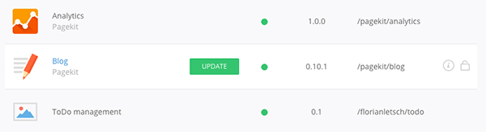
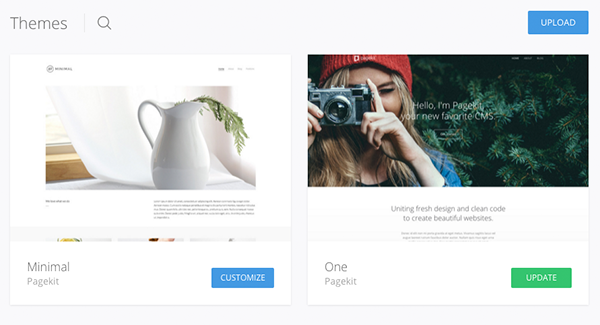

# Updating

Before you perform an update of Pagekit or an installed package, make sure you have a backup of your files and the database. That way you can always recover previous states of your installation in case something goes wrong.

## Update Pagekit

The recommended way of updating Pagekit is through its admin panel. Open _System > Update_ and click the _Update_ button. To make sure that the update was successful, just open _System > Info_. If everything went smoothly, you should see the new version number under the _System_ tab.

**Note** It is possible to update Pagekit manually, although it's not recommended. To do so, [download](http://pagekit.com/api/download/latest) the latest release from [http://pagekit.com](http://pagekit.com) and extract the archive. Then upload the folder to your webserver and overwrite the existing files in the Pagekit folder. A database update (if present) is triggered after logging in to the admin panel.

## Update Extensions and Themes

Extensions and themes can be updated from the System settings in the Pagekit admin panel. Navigate to _System > Extensions_ to see your installed extensions or navigate to _System > Themes_ to see the themes which are currently installed.

If an item has an update available, you will see a green _Update_ button next to the item in the list. Simply click this button to install the update.

For extensions, you will find the _Update_ button next to the extension name.

For themes, you will find the _Update_ button in the bottom right corner below the theme thumbnail.

