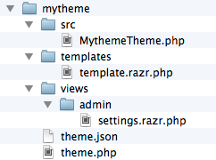

# How to create a theme

<p class="uk-article-lead">Get started and create your own theme for Pagekit.</p>

## Create file structure

Each theme in Pagekit is located in its own folder in the `/themes` directory. In order for Pagekit to recognize directory as a valid theme, you have to follow a certain file structure, at least for a few required files.

You can create the basic structure manually or use Pagekit's provided command line tool that creates the initial structure for you. In this tutorial we will be using the command line tool. 

Open the terminal and navigate to your Pagekit folder. To create a theme called `mytheme` , just run the following command.

```bash
php pagekit theme:generate mytheme
```

You will be prompted for some information needed to initialize the theme.

| Input             | Example               | Description |
|-------------------|-----------------------|--------------|
| `Title`           | `My Theme`            | The human readable name of your theme 
| `Author`          | `YOOtheme`            | Your name or your company's name
| `Email`           | `demo@yootheme.com`   | Your email address
| `PHP Namespace`   | `MyTheme`             | Identifier used to organize your code files. PHP namespaces usually follow a CamelCase syntax.

Have a look at the generated `/themes/mytheme` folder. In this tutorial, we will look at theses files one by one, whenever we add a a feature, we will talk about the fiels needed.



To begin with our theme, we just want to display a simple message. To do so, please open `themes/mytheme/templates/template.razr`, the content will look as follows.

```html
<!DOCTYPE html>
<html>
    <head>
        <meta charset="utf-8">
        @action('head')
    </head>
    <body>

    </body>
</html>
```

In the `<body>` section, insert your message so that the file looks something like this.

```html
<!DOCTYPE html>
<html>
    <head>
        <meta charset="utf-8">
        @action('head')
    </head>
    <body>
        <h1>Hello Pagekit.</h1>
    </body>
</html>
```

Save the file and navigate to the Pagekit admin area in your browser to activate the theme. To do so, go to the *Settings* screen and click on *Themes*. Amongst the installed themes you should see your theme. Click the *Enable button*. Now have a look at the Pagekit installation, it should display the message you've inserted in the template file.

## Set up the main layout

We've managed to have our main template file display a message to the user. Our next task will be to replace this message with the content coming from Pagekit.

To do so, simple replace the static message `<h1>Hello Pagekit.</h1>` with `@action('content')` inside your theme's `template.razr`.

```html
<!DOCTYPE html>
<html>
    <head>
        <meta charset="utf-8">
        @action('head')
    </head>
    <body>
        @action('content')
    </body>
</html>
```

Refresh in the browser and see some content appear in front of your eyes. If your page is blank, make sure you have some content in your Pagekit installation and that the page you're on actually links to something like the blog, a single blog post or a static page.

We've already used the `@action` keyword twice and we will use it more often in the course of this guide. The basic idea here is that components in Pagekit (and any extension that is enabled) can register their content to specific actions. The `head` action for example is reserved for all things related to resources loaded in the `head` section. Pagekit will also output meta and title tags here. `content` is reserved for the main content on the current page - as you might have guessed.

Other `action` keyowrds include ... TODO: list all important actions (messages, ...?)

## Add CSS and JS

Now that we have our basic markup, it's time to add some of our own styling. We'll also see how JavaScript files can be included comfortably.

To add some basic styling, please create a `css/` folder inside your theme folder and add some CSS in `css/theme.css`.

```CSS
body {
    background: #eee;
    font-family: sans-serif;
}
```

In `templates/template.razr`, add the following line right after `@action('head')`.

```PHP
@style('theme', 'theme://mytheme/css/theme.css')
```

Refresh your browser to make sure it picks up the style changes. As you can see, the `@style` directive generates the right `<link ...>` syntax. Note how we assign the name `'theme'` to the included stylesheet. This is used to reference the stylesheet lateron, as assets (= CSS and JavaScript files) can require other assets to be included in advance. Even if no other file will reference the stylesheet, we still havce to assign a name as the first parameter.

To see the mentionen require functionality in action, we include jQuery on our page as well. Pagekit actually comes with a few scripts right from the start so that not every single theme and extension need to include their own version of commonly used libraries. Add `@script('jquery')` to `template.razr` so that the complete file looks as follows.

```HTML
<!DOCTYPE html>
<html>
    <head>
        <meta charset="utf-8">
        @action('head')
        @style('theme', 'theme://mytheme/css/theme.css')
        @script('jquery')
    </head>
    <body>
        @action('content')
    </body>
</html>

```

The directive `@script('jquery')` will add `jquery` to the list of required assets. This list is filled before the renedering process begins. This allows Pagekit to resolve all requirements. Scripts are sorted in the order they are required and only included once, even if several components require the same asset (which is a common case if you think about libraries like jQuery). To actually include your own script and set certain requirements, use the following syntax where the third parameter is a list of required assets.

```
@script('theme', 'theme://mytheme/js/theme.js', ['jquery', 'uikit', 'uikit-notify', 'uikit-sticky', 'uikit-sortable'])
```

For a full list of assets included in Pagekit's installation, check out the asset list in the documentation (TODO).

## Add a settings screen 


## Widget positions

## Widget options

## Prepare for the market place

- details and screenshot in theme.json