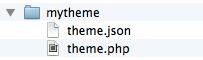

# How to create a theme

<p class="uk-article-lead">Get started and create your own theme for Pagekit.</p>

## Create the file structure

Each theme in Pagekit is located in its own folder in the `/themes` directory. In order for Pagekit to recognize a directory as a valid theme, you have to follow a certain file structure, at least for a few required files.

## Command line

There are several ways to create the basic file structure. In the course of this tutorial, we will create the needed files by hand. If you like the command line, you can run a single command to create the structure (`php pagekit theme:generate mytheme`, more on that in the [advanced theme docs](themes.md)). 

## Download the hello theme

Check out the `hello` theme we've prepared for you. Apart from the basic structure, that package also includes examples of the functionality we will explain in this tutorial.

## Create the files manually

To get started, create an empty folder `/themes/mytheme`. Create three empty files `theme.json` and `theme.php` and `templates/template.razr`. This is the minimal set of files needed for a theme, though we still need to add some content before the theme will be available in Pagekit's back end.



| File                         | Needed?  | Description        |
|------------------------------|----------|--------------------|
| `template/template.razr`     | required | Main template file |
| `theme.json`                 | required | Theme metadata     | 
| `theme.php`                  | required | Theme settings     | 

When working with themes, you will add more and more files. Even though we won't need all of them in this tutorial, have a look at the following structure to understand what the structure for a more complex theme will look like.


| File                         | Needed?  | Description        |
|------------------------------|----------|--------------------|
| `src/MythemeTheme.php`       | optional | Needed when you want to add your own functionality using PHP | 
| `views/admin/settings.razr`  | optional | View file for a settings screen in the back end |
| `css`                        | optional | CSS files          |  
| `js`                         | optional | JavaScript files   |  
| `images`                     | optional | Image assets       | 

Let's have a look at the files we actually need in the beginning: `theme.php`, `theme.json` and `templates/template.php`.

## theme.php

`theme.php` includes a PHP array with all configuration for your theme. Let's start off with no configuration at all: an empty array.

```
<?php return array();
```

## theme.json

`theme.json` contains meta data which is used by Pagekit's back end and the marketplace.

```js
{
    "name": "mytheme",
    "version": "0.0.1",
    "type": "theme",
    "title": "My Theme",
    "description": "",
    "license": "",
    "authors": [
        {
            "name": "YOOtheme",
            "email": "demo@yootheme.com",
            "homepage": "http://yootheme.com"
        }
    ]
}
```

## template.razr

`templates/template.razr` is the main file for the theme markup. Let's begin with some basic markup.

```html
<!DOCTYPE html>
<html>
    <head>
        <meta charset="utf-8">
        @action('head')
    </head>
    <body>
        @action('content')
    </body>
</html>
```

Save the file and navigate to the Pagekit admin area in your browser to activate the theme. To do so, go to the *Settings* screen and click on *Themes*. Amongst the installed themes you should see your theme. Click the *Enable* button. Now have a look at the Pagekit installation, it should display some content without any styling. 

**Note** If your page is blank, make sure you have some content in your Pagekit installation and that the page you're on actually links to something - like the blog, a single blog post or a static page.

## Templating

The starting point for your theme's rendering is the main template file `templates/template.razr`.

As you've seen, the templating language of choice is [Razr](https://github.com/pagekit/razr) which is a superset of PHP. You can use PHP for templating, but Razr offers you a lot of shorthand syntax and quick access to many functions provided by Pagekit.

We've already used the `@action` directive twice and we will use it more often in the course of this tutorial. The basic idea here is that components in Pagekit (and any extension that is enabled) can register their content to specific actions. The `head` action for example is reserved for all things related to resources loaded in the `head` section. Pagekit will also output meta and title tags here. `content` is reserved for the main content on the current page - as you might have guessed.

Your theme should render the following actions on every page.

| Action                  | Description       |
|-------------------------|-------------|
| `@action('head')`       | Renders meta tags and assets, put this in the `<head>` section. |
| `@action('content')`    | Renders the content of the current page, put this somewhere in your `<body>` section. |
| `@action('messages')`   | System and extension messages like error and success notifications. Good practice is to have these appear on top of your page. |

## Add CSS

Now that we have our basic markup, it's time to add some of our own styling. We'll also see how JavaScript files can be included comfortably.

To add some basic styling, please create a `css/` folder inside your theme folder and add some CSS in `css/theme.css`.

```css
body {
    background: #eee;
    font-family: sans-serif;
}
```

In `templates/template.razr`, add the following line right after `@action('head')`.

```
@style('theme', 'theme://mytheme/css/theme.css')
```

Refresh your browser to make sure it picks up the style changes. As you can see, the `@style` directive generates the right `<link ...>` syntax. Note how we assign the name `'theme'` to the included stylesheet. This is used to reference the stylesheet later on, as assets (= CSS and JavaScript files) can require other assets to be included in advance. Even if no other file will reference the stylesheet, we still have to assign a name as the first parameter.

## Add JavaScript

Just like CSS, JavaScript files are included by Pagekit's assets management. You can use the same `require` functionality as we've just seen with CSS.

To require some provided JavaScript, let's include jQuery on our page. Pagekit actually comes with a few scripts right from the start: no need to include your own version of commonly used libraries. Add `@script('jquery')` to `template.razr` to make the complete file look as follows.

```html
<!DOCTYPE html>
<html>
    <head>
        <meta charset="utf-8">
        @action('head')
        @style('theme', 'theme://mytheme/css/theme.css')
        @script('jquery')
    </head>
    <body>
        @action('content')
    </body>
</html>

```

The directive `@script('jquery')` will add `jquery` to the list of required assets. This list is filled before the rendering process begins. This allows Pagekit to resolve all requirements. Scripts are sorted in the order they are required and only included a single time, even if several components require the same asset (which is a common case if you think about libraries like jQuery). To actually include your own script and set certain requirements, use the following syntax where the third parameter is a list of required assets.

```
@script('theme', 'theme://mytheme/js/theme.js', ['jquery', 'uikit', 'uikit-notify', 'uikit-sticky', 'uikit-sortable'])
```

For a full list of assets included in Pagekit's installation, check out the asset list in the documentation (TODO).


## Getting started with Widgets

So far, our theme looks the same on every single page. The only thing that changes is the main content of the current view - a static page or a blog post. There are other areas we want to customize, sidebars we want to fill with content, a footer, a logo that should be changed and so on. We also need a place for our site navigation to appear.

All of this (and much more) can be done with widgets. Widgets are chunks of content that can be positioned inside a theme and configured to appear on certain pages and be hidden on others. When developing a theme, we do not care about what kind of content the widget renders. The only thing we need to do is to offer positions in our theme where widgets can be rendered.

To add widget functionality to the theme, there are three steps we need to take.

1. List all provided widget positions in our `theme.php`.
2. Create a renderer that determines how multiple widgets in a single position are rendered. List all provided renderers in our `theme.php`.
3. Render all published widgets in their assigned position in `templates/template.razr`.


## Widget renderer

A single widget position can hold more than one widget. To determine how those widgets are rendered, Pagekit supports so called `renderers`.  You could create one renderer that display all widgets with equal widths in columns next to each other. A second one could render all widgets stacked on top of each other. By giving the user the option to choose between those renderers for every widget position, they can significantly customize the layout of their page without changing code inside the theme.

We'll start off by creating a single renderer that plainly renders all published widgets without any fancy markup. Let's call it `blank`. To make sure Pagekit knows about it, add the `renderer` option to our `theme.php`.

```
<?php 
    return array(
        'renderer' => array(
            'blank'     => 'theme://mytheme/views/renderer/position.blank.razr')
        );
```

Now, create the folder `/mytheme/views/renderer` and a file `/mytheme/views/renderer/position.blank.razr` with the following content.

```
@foreach ($widgets as $widget)
    @raw( $provider.render($widget, $options) )
@endforeach
```

We use Razr's `@foreach` directive to iterate over all widgets in the current position. Every widget is rendered by passing it to the `render` function of the view service provider which is available via `$provider`. The `@raw` directive outputs the generated markup without escaping special characters.

## Widget positions

We need to tell Pagekit about the widget positions our theme offers. To do so, add an array of all widget positions to the `theme.php`. This array includes the unique title of the position (usually lowercase) and the label we want to show to the user in the back end.

Add the widget positions to your `theme.php`.

```PHP
'positions' => array(
    'logo'       => 'Logo',
    'navbar'     => 'Navbar'
),
```

In our template, we now need to add the actual rendering of widgets in those positions. For each positions, we check if a widget is published and then render it. Note how we set the `blank` renderer we've created before. 

**Note** The `@raw` directive makes sure the rendered widget markup is not escaped.

```php
@if ($position.exists('logo'))
    @raw( $position.render('logo', ['renderer' => 'blank']) )
@endif
```

## Create a widget

To make sure our new widget position works, we go the the admin area of Pagekit and create a new widget in the logo position. Navigate to the *Widgets* area and hit *Add widget*. In the drop down, select the *Text* type. Type in any content you like. On the right ahnd side, you see a dropdown for widget positions. You should be able to see all positions defined by our theme. Select `logo` and make sure to set the *Status* to *Enabled*. Save the widget 

In this tutorial, we will only include th the `logo` position. But just like that, you can define your own positions. It is recommended to include the following basic set of widget positions. When your theme sticks to these, users can just enable a new theme and existing widget assignments will be picked up automatically.

| Position name | Label       |
|---------------|-------------|
| `logo`        | Logo        | 
| `logo-small`  | Logo Small  |
| `navbar`      | Navbar      |
| `top-a`       | Top A       | 
| `top-b`       | Top B       | 
| `sidebar-a`   | Sidebar A   | 
| `sidebar-b`   | Sidebar B   |
| `footer`      | Footer      | 
| `offcanvas`   | Offcanvas   | 

## Where to go from here

Congratulations, you've created your first theme! We've introduced the basic file structure and talked about the most important configuration options. You know how to change the markup, include CSS and JS and how to add widget functionality. Now it's time to get creative and play around.

If you're looking for advanced functionality, here are some pointers to other sections of the documentation:

- Add additional configuration to your theme. See [Configuration](configuration.md) for more information.
- Add a settings page to your theme. See [Settings](settings.md) for more information.
- Upload your theme to the Pagekit marketplace so others can enjoy it. See [Marketplace](marketplace.md) for more information.
- A more developer centric view on building themes is available in the [Themes section](themes.md).

For questions and discussion on best practices, check out the Google+ community.