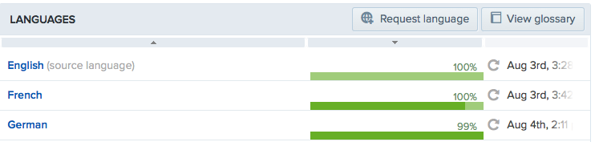

# How to create a translation

We work with Transifex, a simple and easy platform where you can share language files to work together on translations.

Feel free to join the official [Pagekit project](http://www.transifex.com/organization/pagekit/) on Transifex. After a fast [sign up](http://www.transifex.com/signup/) you can help correct existing translations or add your own language.

## Contribute to an existing translation

If you would like to improve or complete an existing translation, go to the [Pagekit project](http://www.transifex.com/organization/pagekit/) on Transifex and choose the language you want to contribute to. You will then see all extentions as *Resources* that can be translated:

| Extention    | Description |
|--------------|-------------|
| Blog         | This is the translation for the Blog extention |
| Installer    | This is the translation for the Installer extention |
| Page         | This is the translation for the Page extention |
| System       | This is the translation for the System extention |

To take part in the Pagekit project, you must first click the *Join team* button that you can find in every language folder. Once we approve your request, you will be able to access to the language team and start translating the project.

 

Choose the resource you want to contribute to by clicking on it, this will open an options screen. By clicking *Translate now* you will enter the Transifex's editor which allows you to translate on the fly without down- and uploading any files.

## Request a language

If your language is not listed, you can add a new language to the project. To do so, go to the [Pagekit project](http://www.transifex.com/organization/pagekit/) on Transifex and add a new language by clicking the button on the right side *Request language*. We will then get notified and can review and approve your added language. 

 

Following our approval, you will have two options:

### Start the translation in Transifex's editor

If your requested language was approved, you can start to translate the extensions or *Resources* as they are called in Transiflex. Just click the resource you want to work on and press the button *Translate now*.

### Upload a .po file
In case you already created a .po language file, you can upload your it easily by clicking on the resource and then *Upload file*.

A green bar in each column shows you the progress of each translation.

