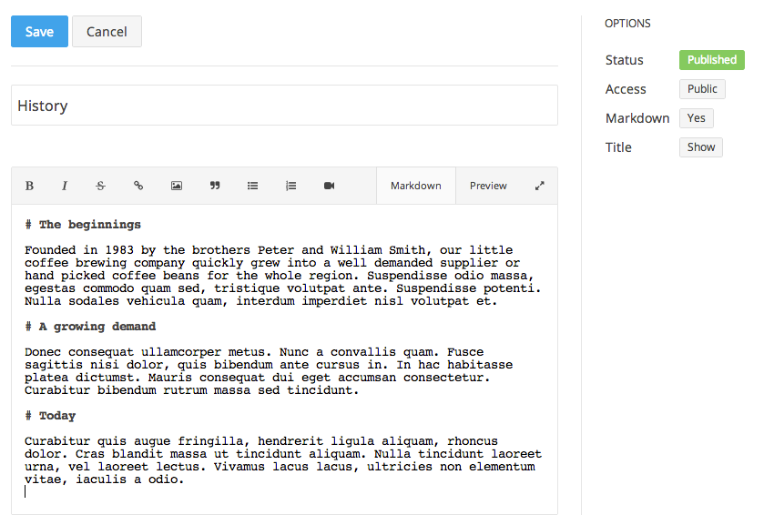

## Pages

Pages are basically the equivalent to a static webpage. They live outside the blog context, meaning that they aren't thought of as being published at one specific date. Typically you would use pages for content that rarely changes, like your homepage, an about us, your contact page or anything that doesn't feel like an article living in a certain category.

A slug is a computer friendly version of the title so that it can be included in the absolute URL to the page. If you do not like the generated slug, simply click on it to choose your own.

By default, the page is *unpublished*. When you are done creating the content and saving the page, click the red *unpublished* label to publish the page.

Page settings are available from the overview - or from the single page edit view.

