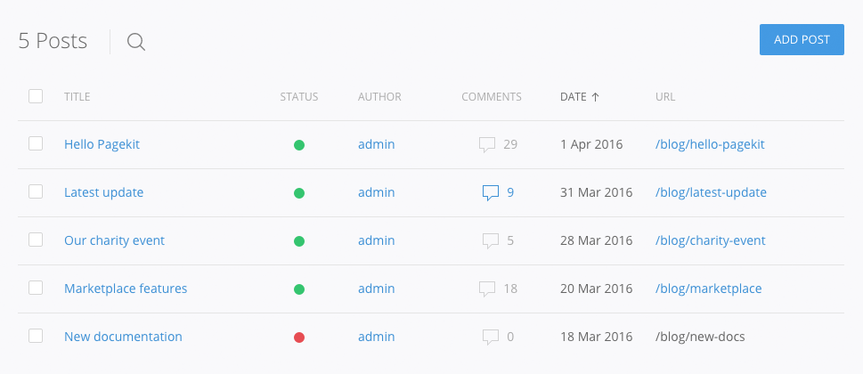
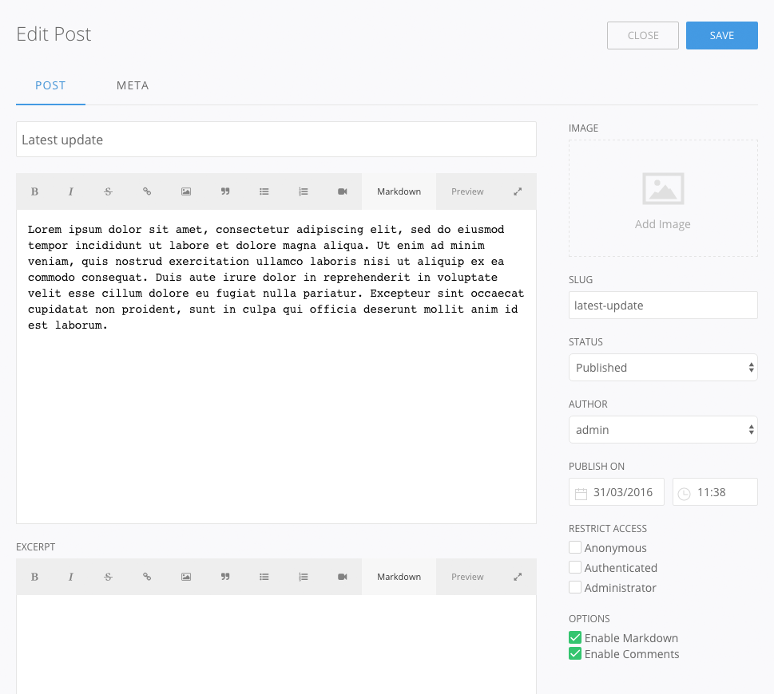
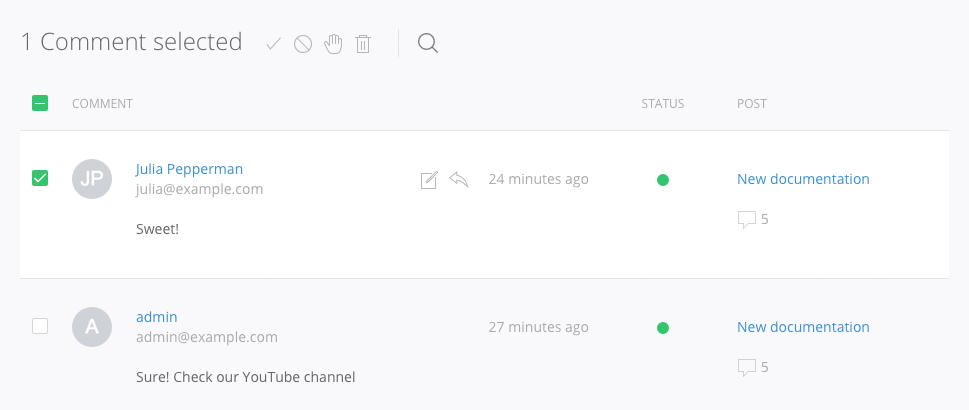

# Blog

The Blog extension allows you to create articles using markdown and HTML. A WYSIWYG editor is available with the TinyMCE extension. The comments section allows users to interact with your content.

<ul class="uk-list">
    <li><a href="#posts">Posts</a></li>
    <li><a href="#comments">Comments</a></li>
    <li><a href="#settings">Settings</a></li>
</ul>

## Posts

The _Posts_ section provides an overview of all your articles, which form the content of your website. You can create new articles or edit existing ones. Posts can be sorted by title, number of comments or their publish date by clicking on the corresponding table heading in the overview. The active sorting parameter is highlighted with an arrow icon.

Next to each post there’s a checkbox. Enabling the checkbox of one or more items will display a toolbar that allows you to copy, delete, publish or unpublish the posts.

To create a new post, hit the *Add Post* button in the top right hand corner; to edit an existing post, click on its title in the overview. The [Pagekit Editor](editor.md) will open and the following fields will be available.

Field           | Description
:-------------- | :-----------------------------------------------------------------------------------------------------------------------------------
Title           | This is the title of your post. You can use umlauts and other symbols and Pagekit will automatically create a URL-valid slug for the post.
Slug            | A computer friendly version of the title that is included in the absolute URL of the page (if you set the slug in the custom field of the permalink section in the _Settings_ tab). If you do not like the generated slug, simply enter your own.
Content         | This is where you create the actual content of your post. You can write Markdown or HTML using the [Pagekit editor](editor.md).
Excerpt         | The excerpt is a preview or a summary of the post and will be displayed in your blog overview. Otherwise, the full article will be displayed. Alternatively, you can separate your intro text right in the content field by adding the snippet **&#91;readmore&#93;**. However, the _Excerpt_ field will always have priority over the snippet. A **Read More** button leads your user from the excerpt to the full article. 
Image           | Use the image picker to select the featured image for your post or type in the URL.
Status          | Select the status of your post. It can be a **Draft**, **Pending Review**, **Published** or **Unpublished**. Only a published post is visible to the public. The **Draft** and **Pending Review** statuses allow editors to see that a post is pending review.
Author          | Select the user you would like to credit as the post's author.
Publish On      | The date when the post should become publicly accessible. You can schedule a post by setting the publish date in the future. A calender icon in the status bar indicates a scheduled post.
Restrict Access | You can restrict access for each post to one or more [user roles](users.md). Other users will not be able to see the post in the frontend. Leaving all checkboxes unchecked will keep the post visible for everyone.
Enable Markdown | Your post's content can be written in HTML or using [Markdown syntax](http://daringfireball.net/projects/markdown/syntax). Enable or disable Markdown editing with the checkbox. You can also include HTML snippets in Markdown
Enable Comments | Allows users to engage in discussion about your post. You can manage comments in the [Comments](#comments) section.

## Comments
The _Blog_ extension includes a sophisticated comment function that you can manage and curate in the _Comments_ section of the blog administration. It provides a list of the comments to all posts in your site.

If you click on the **Status** parameter in the table heading, you can sort comments by whether they are **Pending**, **Approved** or marked as **Spam**.

Each item displays the author and – if provided – their email address above the comment's content. Clicking on the timestamp will bring you directly to the the comment's location below the post. To approve a comment or mark it as pending, hit the green or yellow circle in the status column. In the _Post_ column, click on the post's title to enter Edit mode. To see all comments on that post, click on the comment icon, which also indicates the number of comments.

When hovering a single entry, an _Edit_ and a _Reply_ button will appear for that comment. In Edit mode you can also switch the comment's status from **Pending** to **Approved** or **Spam**.

## Settings
The **Settings** tab contains general Blog settings – like permlink options – as well as some additional options for the comment function.

### General

In this section you can configure the overall behavior of your blog.

Field                 | Description
:-------------------- | :-----------------------------------------------------------------------------------------------------------------------------------------------------------------------------------------------------------------------------------------------------------------------------------------
Permalink             | There are different options of how the permalinks of your posts will be generated, which can be **Numeric**, **Name** (basically a slug generated from the post's title), **Day and name**, **Month and name** or **Custom**. The **Custom** field accepts the following parameters: <code>{id}</code>, <code>{slug}</code>, <code>{year}</code>, <code>{month}</code>, <code>{hour}</code>, <code>{minute}</code> and <code>{second}</code>. These can also be combined; just separate them with a <code>/</code>.
Posts per page        | Determine the maximum amount of posts that will be displayed per page in the blog overview.
Default post settings | Enable or disable Markdown and comments for all posts. You can still override these settings in each post.

### Comments

Here you can define a number of global settings for the comment function.

Field                 | Description
:-------------------- | :-----------------------------------------------------------------------------------------------------------------------------------------------------------------------------------------------------------------------------------------------------------------------------------------
Comments              | Determine whether users need to provide an e-mail address in order to comment and set a period of time after which it is no longer possible to comment a post.
Appearance            | Enable [Gravatar](http://gravatar.com), change the order of comments and allow nesting of comments by a maximum number that you set.
