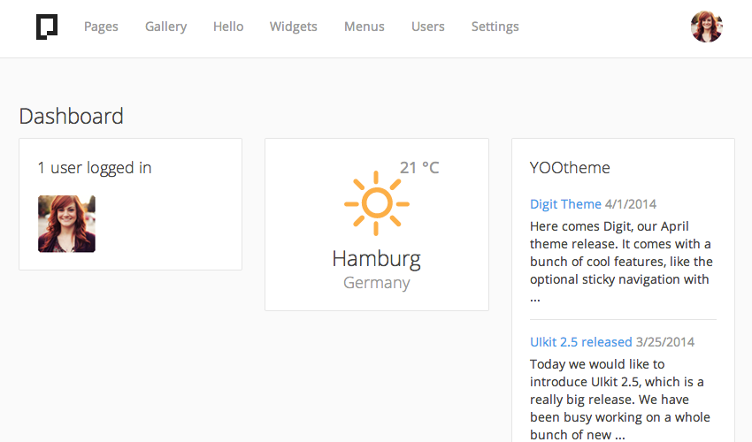

# Dashboard

The Dashboard is the first thing you see when entering the Pagekit admin panel. All information you find here, e.g. statistics on your site's activity, comes from widgets configured for the whole project. In Pagekit, you only have to set up the Dashboard once and it will be available for all users of the site. Keep that in mind when you do not want all users to see i.e. your Analytics.

## Add Widget to the Dashboard

Click the *Add Widget* button on the top right. You will see a Dropdown of all available Widgets. Choose the one you want to add.

## Edit Widgets

When you hover over a Widget, an *Edit* icon will appear in the top right corner of the Widget. Click it to enter editing mode. Modify all settings you want to change and confirm with clicking the *Checkmark* icon in the top right corner of the Widget.

## Arrange Widgets

To arrange the Widgets on the Dashboard, use simple Drag and Drop on the single Widget. It is easiest to arrange on a large screen where you see three columns of Widgets. On smaller screens, the Widgets will be rearranged automatically depending on the device size.

## Install more Widgets

Any extension in Pagekit can provide additional Widgets for the Dashboard. Head over to the Marketplace and see what is currently available. A good one to try is the Analytics extension, which allows you to display your Google Analytics data in beautiful graphs. 
