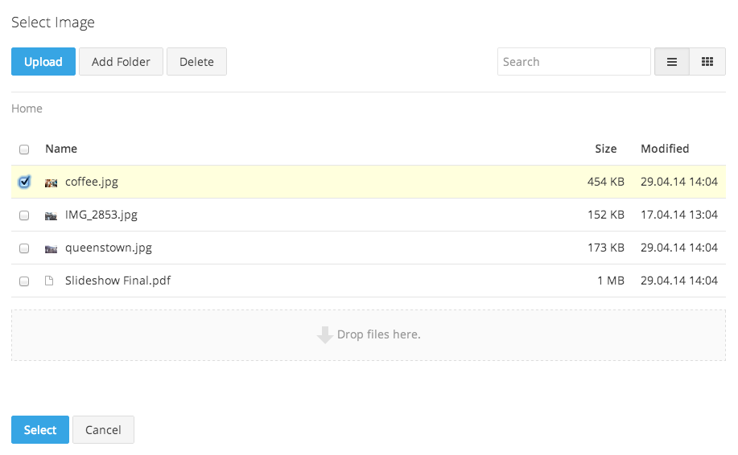

# The Markdown Editor

Let's introduce you to the the main editing tool you will see in all places: Pagekit's powerful markdown editor.

To edit content, you can write HTML with some autocompletion aid or use the popular [markdown syntax](http://daringfireball.net/projects/markdown/syntax). You can even include HTML snippets in markdown. As you create your content on the left, you will see a real-time preview of the final output on the right. To define how the content is rendered, you can enable or disable markdown in the settings above the editor. The editor's toolbar supports you with common markdown elements and allows you to choose text styles, insert links, quotes, lists and media elements.

## Inserting images

To insert an image, just click the image icon and a placeholder area will appear in the content preview. Hover over the placeholder and click on the *Settings* button. A modal will appear where you can choose a picture or drag and drop the desired image file from your local file browser.

### Step 1: Settings for a blank image

### Step 2: Select an image from the storage

### Step 3: Updated settings for your chosen image

**Note** Adding videos or other binary files works just the same - and when you've inserted your files you can always go to the *Settings* dialog again.

## Inserting Links

Links have a little pencil icon that you can click to call up the settings panel - either select the link's destination or manually enter a URL.

