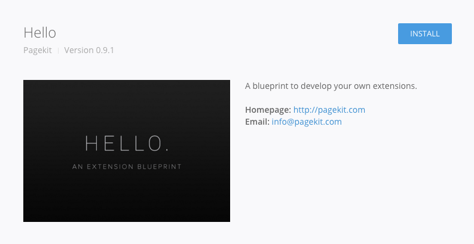

# Marketplace

Find official and third party extensions and themes and install them with one click.

## Browse available packages

The Marketplace is divided into a section for extensions and one for themes. You can navigate between those using the tabs at the top of the interface.

## Install a package

When clicking on the preview of each extension or theme a modal window will open that contains further information on the product. Just hit the _Install_ button in the upper right corner.

When the installation has finished, you will see an _Enable_ button to activate the extension or theme right away. If you want to disable and enable packages lateron, navigate to _System > Extensions_ or _System > Themes_ where you can see all items currently installed in your system.

