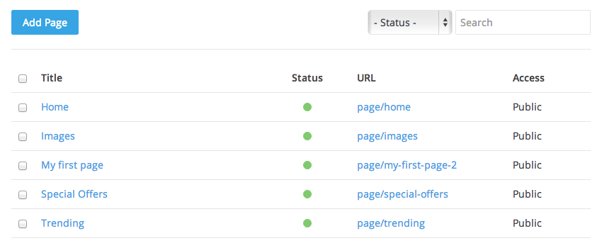

# Site Pages

This is the place where you manage the site's menus and pages, structured in a tree view for easy managing.

## Menus

You can see an overview of all menus on the left and their pending pages on the right. Hover a single entry to see an *edit* and *remove* button for that menu. New menus can be created by clicking on the *Add Menu* button.

Each menu linked pages are displayed on the right. Pages without a menu are listed in the *Not Linked* view, while trashed pages are listed in the *Trash* view, both accessible below the menus list.

## Pages

Menu pages can be managed on the right list. They can be sorted quickly via drag-and drop or disabled/enabled by clicking on the green or red circle in the status column. When one or more pages are selected through the checkboxes a toolbar will appear allowing to to perform additional batch tasks as changing the state, moving the pages to another menu or deleting them.

To create a new page click on the *Add Page* top right button and choose the type of page you are willing to create. Pagekit comes with a few pre-defined ones - any extension can add new types to that list.

### Type Pages

Pages are basically the equivalent to a static webpage. They live outside the blog context, meaning that they aren't thought of as being published at one specific date. Typically you would use pages for content that rarely changes, like an *About Us*, *Contact* page or anything that doesn't feel like an article living in a certain category.

In the **Content** tab you can edit the page main content, such as the article body, title and slug. Additionally you can set the Menu title which will be displayed in the frontend Menu list, the page status, access and linked menu. The **Settings** tab will display an overview of the page basic settings. Finally, the **Theme** tab holds the theme specific options.

**Note** A slug is a computer friendly version of the title so that it can be included in the absolute URL to the page. If you do not like the generated slug, simply click on it to choose your own.

### Type Link

Links are the most flexible type as they can create a menu entry linking to any internal or external URL.

In the **Settings** tab the URL field allows inputting manually the value or use the assistant by clicking the *select* button. The URL assistant allows choosing the extension and view which you are willing to link to. The link type field allows choosing if the link should be a normal link, an alias of another link or a redirect.

**Note** Changing the link type could affect your site SEO, leave it to default *link* if you are not sure what it is about.

As in page type the tabs **Settings** and **Theme** offers an overview of basic settings and theme specific ones respectively.
