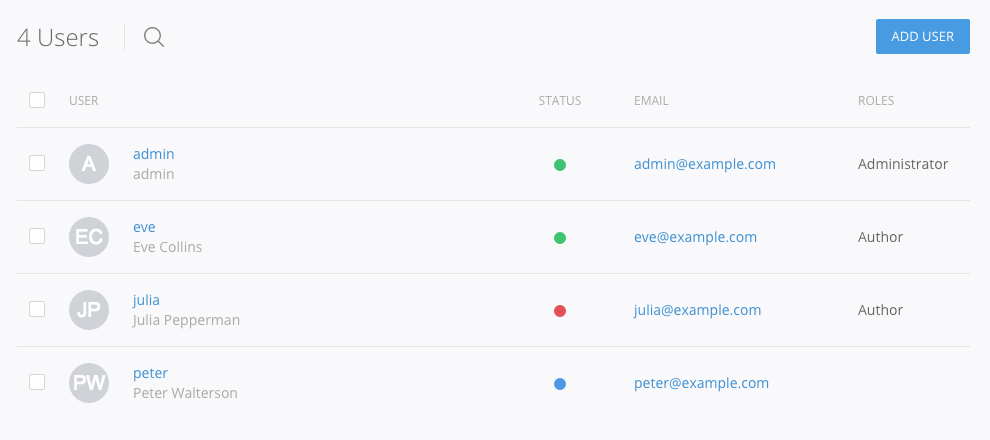

# Users

Create and manage users, user roles and access levels to control how much access users have to your site.

## List

In the *List* tab, you can search, add, activate, block or delete certain users using the toolbar buttons. When a new user is added or an existent edited, by clicking on its name, the user edit view is displayed showing the following fields.

| Field | Description |
| :---- | :---------- |
| **Username** | The username that identifies the user (limited to alphanumeric characters, numbers, dot and underscore). |
| **Name** | The name that will be displayed when referencing the user. |
| **Email** | The email that will be used as main contact method. |
| **Password** | The user password. Click on show to reveal it. |
| **Status** | The user account status. |
| **Roles** | The roles the user is part of. |
| **Roles** | The roles the user is part of. |
| **Last Login** | Displays the last time the user logged in the site. |
| **Registered Since** | Displays the date the user has been registered in the site or his entry created. |

The user's profile picture is displayed as a [Gravatar](https://gravatar.com/) depending on the given email address.

## Permissions

In the *Permissions* tab you can see an overview of user roles and the actions they are allowed to perform.

The permissions are grouped by their according extensions and can be assigned or revoked by toggling the checkboxes. Changes are stored automatically.

**Note** You will have to give the *Access admin area* permission to all roles who should perform any action in the administration panel, even if it is limited to editing pages. Else they won't be able to reach the pages' administration panel.

## Roles

In the *Roles* tab, you can create and manage user roles, a way of organizing users into groups with the same permissions and access levels.

Pagekit comes with a few pre-defined roles, you can also add new ones, if the defaults are not enough for your use-case. The default roles are:

| User / Group     | Description |
|------------------|---------------------------------------------------|
| Anonymous        | Any random visitor to your site.                  |
| Authenticated    | A user with an account who is logged in.          |
| Administrator    | A user with the privilege to perform all actions. |

## Access levels

In the *Access levels* tab, you can configure the visibility of certain parts of your site.

The idea behind this is to set an access level on your content (or menu item etc.) and assign user roles to certain access level. Think of access levels as "Students" and "Teachers" that you've created. That way you can assign content to these groups even when user roles change (new students etc).

By default, you can assign public, registered or special access levels to different parts (menu items, pages etc.) of your website. If the default ones are not enough, you can create and configure your own access levels.
